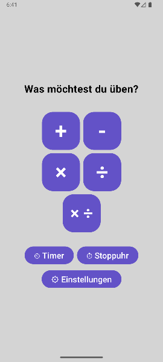
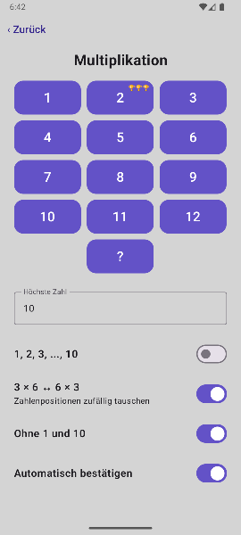
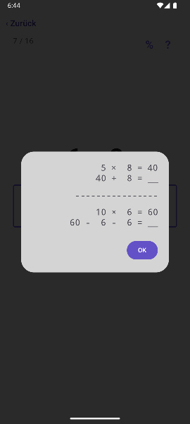

# A math practice app for primary/elementary school children

An offline, ad-free Android app for children to practice arithmetic. All data remains on the device. The app is written in Kotlin with Jetpack Compose and was developed with assistance from OpenAI Codex. It is available in English, German (Switzerland, Germany, and Austria), Spanish, French, Italian, and Dutch.

|  |  |  |
|---|---|---|

## Calculation modes

The home screen provides:

- Addition (`+`)
- Subtraction (`-`)
- Multiplication (`×`)
- Division (`÷`)
- Mixed multiplication/division (`× ÷`)

Multiplication, division, and mixed modes let the child choose a table from 1 through 12. The multiplication and division symbols can be changed in the educator settings because conventions differ between countries. The `?` button samples up to 10 unique calculations across all allowed base numbers while respecting the configured `Highest number`. Each practice set consists of two halves. The first half presents the selected calculations. When pupils make a mistake, the app remembers the number involved and presents it more frequently during the second half (see `Erroneous-result repetition count` under [Hints and educator/parental controls](#hints-and-educatorparental-controls) below).

Addition and subtraction use dedicated setup screens without a table-number selection. Addition supports `Highest input` or `Highest result`. Exactly one of the two limits must be entered.

- Example: `Highest input = 10` → `10 + 10` uses the largest possible inputs.
- Example: `Highest result = 100` → `99 + 1`, `50 + 50`, and `63 + 27` are examples of possible calculations.

Subtraction supports `Highest input` and `Lowest result`; the lowest result must be smaller than the highest input.

- Example: `Highest input = 40; Lowest result = 10` → `40 - 30 = 10` is an edge case that is still allowed.

Each arithmetic mode uses up to 20 calculations when enough unique combinations exist. Multiplication, division, mixed, and wildcard practice include review rounds. Wrong answers open a correction dialog, and the child must enter the correct answer before continuing. The educator can configure how often numbers involved in mistakes are repeated in the second half of the practice set, from 0 to 5 times (default: 3).

## Timer and stopwatch

To help pupils show educators how long they have practiced, the app offers timer and stopwatch modes. Both count active practice time, pause after a developer-configurable 30-second idle timeout, and persist their progress. Completed sessions are shown newest-first in the history dialog with their duration and correct/total scores.

## Hints and educator/parental controls

The educator/parental settings screen is PIN-gated and stores its configuration in SQLite. It controls:

- App language
- Erroneous-result repetition count
- Multiplication and division display signs
- Addition minimum result
- Subtraction minimum input and maximum result
- Allowed base numbers for multiplication, division, and mixed mode
- Hint visibility and highest-digits hints

All numbers are enabled by default, meaning that pupils can practice every table from 1 through 12. Educators can disable individual base numbers. Common candidates are `1`, `10`, and `11` because they are easy, and a child might otherwise practice them repeatedly to avoid more difficult base numbers while still accumulating practice time (see [Timer and stopwatch](#timer-and-stopwatch)).

Multiplication and division hints can be enabled independently. Pressing the `?` button in the top-right corner of the practice screen opens a hint with a strategy for solving the current calculation.

A highest-digits hint can be configured separately for each arithmetic mode. Pressing the `%` button in the top-right corner fills in the leading digit or digits of the result, leaving the user to enter the final digit.

- Example: For `7 × 8`, the input field contains `5`, and the user enters `6` to complete the result.
- Example: For `12 × 9`, the input field contains `10`, and the user enters `8` to complete the result.

The `Erroneous-result repetition count` controls how strongly the second half prioritizes numbers involved in mistakes. With a value of `0`, those numbers receive no special priority: for example, after a mistake involving table `7`, the second half may show table `7` again by chance, but it may also omit it. With a value of `1`, table `7` is deliberately included once in the normal review plan. Higher values reserve more review positions for it, up to the configured count and available space. In `?` mode, these rules determine the review-number pool, after which wildcard sampling chooses calculations from many possible combinations; consequently, even a prioritized number can occasionally be absent from the final wildcard half.

## Persistence

SQLite stores configurations, educator settings, the PIN, scores, and timer/stopwatch history.

## Build and test

Open the project in Android Studio, or run:

```powershell
$env:JAVA_HOME='C:\Program Files\Android\Android Studio 1\jbr'
.\gradlew.bat :app:testDebugUnitTest --no-configuration-cache
.\gradlew.bat :app:assembleDebug --no-configuration-cache
```

The debug APK is written to `app/build/outputs/apk/debug/app-debug.apk`.

## Android requirement

The app requires Android 6.0 (API level 23) or newer.
